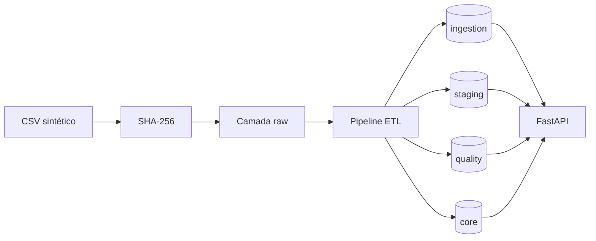
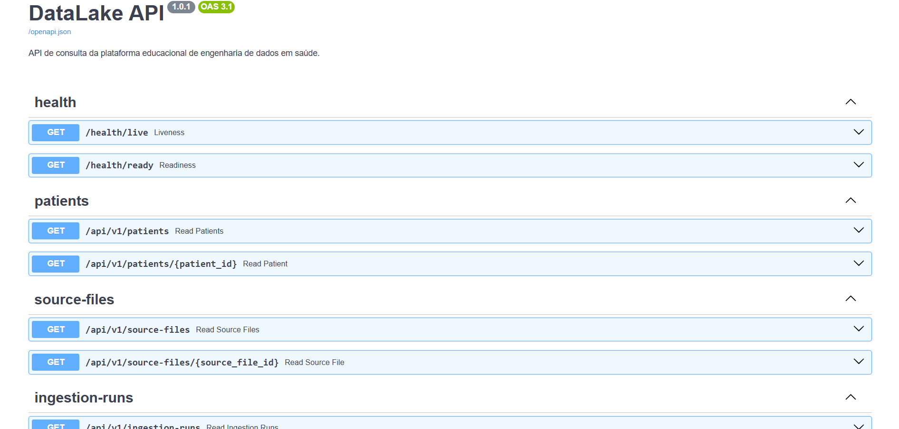

# DataLake

[](https://github.com/marianagpalacios/DataLake/actions/workflows/ci.yml)


[](LICENSE)

Plataforma educacional de engenharia de dados em saúde desenvolvida com Python, PostgreSQL, Docker, Pandas, SQLAlchemy, Alembic e FastAPI.

O projeto simula um fluxo profissional de ingestão de pacientes sintéticos, incluindo preservação da origem, identificação de arquivos por SHA-256, validação de qualidade, sucesso parcial, staging, rastreabilidade, persistência, API REST, testes isolados e integração contínua.

O DataLake é um projeto pessoal de portfólio criado para desenvolver e demonstrar competências em engenharia de dados aplicada à saúde.

## Problema resolvido

Dados produzidos por laboratórios, clínicas, hospitais e sistemas de pesquisa podem representar informações equivalentes com estruturas e formatos diferentes. Sem validação e rastreabilidade, essas diferenças favorecem duplicidades, valores inválidos, falhas silenciosas e perda da relação entre o dado armazenado e sua origem.

O DataLake demonstra como receber um arquivo, preservar sua versão original, validar cada linha, separar registros aceitos e rejeitados, registrar problemas de qualidade e carregar somente dados confiáveis. Cada etapa permanece vinculada à fonte e à execução responsável pelo processamento.

## Status do projeto

**Versão estável v1.0.0 concluída.**

O DataLake implementa uma plataforma educacional completa de engenharia de
dados em saúde, incluindo ingestão, qualidade, ETL, staging, rastreabilidade,
API REST, testes isolados e integração contínua.

## Principais capacidades

- ingestão de pacientes sintéticos por CSV;
- leitura tabular com Pandas;
- validação estrutural;
- validação linha a linha;
- separação entre válidos e rejeitados;
- métricas de qualidade;
- relatórios CSV de rejeição;
- identificação de arquivos por SHA-256;
- camada raw;
- staging no PostgreSQL;
- histórico de execuções;
- data lineage;
- idempotência;
- reprocessamento controlado;
- API REST versionada;
- paginação e filtros;
- Swagger UI, ReDoc e OpenAPI;
- banco exclusivo de testes;
- cobertura de linhas e branches;
- GitHub Actions;
- build automatizado do pacote e da imagem Docker.

## Arquitetura



O PostgreSQL é separado em quatro schemas:

- `ingestion`: fontes, arquivos, execuções, status e métricas;
- `staging`: todas as linhas recebidas e seus valores normalizados;
- `quality`: problemas encontrados durante a validação;
- `core`: registros confiáveis e tratados.

Consulte a descrição detalhada em [Arquitetura](docs/architecture.md).

## Tecnologias

| Área | Tecnologias |
|---|---|
| Linguagem | Python 3.14 |
| Banco de dados | PostgreSQL 17 |
| Processamento tabular | Pandas |
| Persistência | SQLAlchemy 2 |
| Migrações | Alembic |
| API | FastAPI e Pydantic |
| Servidor ASGI | Uvicorn |
| Infraestrutura | Docker e Docker Compose |
| Testes | Pytest, HTTPX e pytest-cov |
| Qualidade | Ruff e Coverage.py |
| Empacotamento | PyPA Build e setuptools |
| Integração contínua | GitHub Actions |

## Execução rápida

### Pré-requisitos

- Git;
- Docker Desktop com Docker Compose;
- PowerShell;
- Python 3.14, caso a CLI seja executada no host.

### Preparar as configurações

```powershell
Copy-Item .env.example .env
```

Edite somente a senha local em `.env`. O arquivo não deve ser versionado.

### Iniciar a plataforma

```powershell
docker compose up -d --build
docker compose ps -a
```

O resultado esperado é:

- `postgres` saudável;
- `migrate` concluído com código 0;
- `api` saudável.

### Abrir a documentação da API

```powershell
Start-Process "http://localhost:8000/docs"
```

### Instalar e executar uma ingestão

```powershell
python -m venv .venv
Set-ExecutionPolicy -Scope Process -ExecutionPolicy RemoteSigned
.\.venv\Scripts\Activate.ps1
python -m pip install -e ".[dev]"

python -m datalake.ingestion.cli `
  data/examples/patients_with_quality_issues.csv `
  --source-name "synthetic_patient_csv"
```

Para encerrar os serviços sem remover o volume do banco:

```powershell
docker compose down
```

## Pipeline ETL

O pipeline executa as seguintes etapas:

1. verifica a existência e as propriedades do arquivo;
2. calcula o SHA-256;
3. preserva uma cópia na camada `data/raw`;
4. registra a fonte, o arquivo e a execução;
5. lê o CSV com Pandas;
6. valida a estrutura obrigatória;
7. valida e normaliza cada linha;
8. persiste todas as linhas no schema `staging`;
9. registra rejeições no schema `quality`;
10. insere pacientes válidos ainda inexistentes em `core.patients`;
11. gera artefatos processados e relatórios de rejeição;
12. finaliza a execução com métricas e status.

Os status possíveis são:

- `running`;
- `completed`;
- `completed_with_rejections`;
- `failed`;
- `skipped_duplicate`.

Arquivos com o mesmo SHA-256 e a mesma fonte lógica são ignorados depois de uma execução concluída. O reprocessamento intencional utiliza `--force`:

```powershell
python -m datalake.ingestion.cli `
  data/examples/patients_with_quality_issues.csv `
  --source-name "synthetic_patient_csv" `
  --force
```

## Qualidade de dados

A validação considera as dimensões de completude, validade, unicidade e consistência temporal. Entre as regras demonstradas estão:

- presença das colunas obrigatórias;
- código externo obrigatório e não duplicado no arquivo;
- data de nascimento no formato ISO `AAAA-MM-DD`;
- data de nascimento não futura;
- sexo biológico pertencente ao domínio permitido;
- normalização de valores opcionais;
- aviso para colunas adicionais.

Uma linha inválida não impede necessariamente o processamento das demais. Execuções com registros válidos e rejeitados recebem `completed_with_rejections`, preservando o sucesso parcial e os motivos de cada rejeição.

Os relatórios locais são gravados em `data/rejected`, e os problemas persistidos são vinculados à linha correspondente em `quality.data_quality_issues`.

## API REST

A API é somente leitura e publica contratos tipados, validação de parâmetros, paginação, filtros e respostas de erro padronizadas.

### Swagger UI

A API possui documentação interativa gerada automaticamente pelo FastAPI.



- [ReDoc](http://localhost:8000/redoc);
- [OpenAPI](http://localhost:8000/openapi.json).

Endpoints principais:

| Método | Endpoint | Finalidade |
|---|---|---|
| `GET` | `/health/live` | Verifica se a aplicação está ativa |
| `GET` | `/health/ready` | Verifica a conexão com o banco |
| `GET` | `/api/v1/patients` | Lista e filtra pacientes |
| `GET` | `/api/v1/patients/{patient_id}` | Consulta um paciente |
| `GET` | `/api/v1/source-files` | Lista arquivos recebidos |
| `GET` | `/api/v1/source-files/{source_file_id}` | Consulta um arquivo |
| `GET` | `/api/v1/ingestion-runs` | Lista execuções |
| `GET` | `/api/v1/ingestion-runs/{run_uuid}` | Consulta uma execução |
| `GET` | `/api/v1/ingestion-runs/{run_uuid}/records` | Consulta o staging da execução |
| `GET` | `/api/v1/ingestion-runs/{run_uuid}/quality-issues` | Consulta problemas de qualidade |
| `GET` | `/api/v1/staged-records/{record_id}/lineage` | Consulta a linhagem de uma linha |

A API não expõe caminhos locais, registros brutos completos, valores brutos dos erros, mensagens técnicas internas ou credenciais.

## Testes

O projeto utiliza um PostgreSQL exclusivo para testes. A suíte interrompe a execução caso o banco configurado não tenha um nome terminado em `_test`.

### Preparar o ambiente

```powershell
Copy-Item .env.test.example .env.test

docker compose `
  --env-file .env.test `
  -f compose.test.yaml `
  up -d
```

### Executar a suíte

```powershell
python -m pytest
```

Seleções disponíveis:

```powershell
python -m pytest -m unit
python -m pytest -m integration
python -m pytest -m api
python -m pytest -m migration
```

### Cobertura

```powershell
python -m pytest `
  --cov=datalake `
  --cov-branch `
  --cov-report=term-missing `
  --cov-report=html `
  --cov-report=xml
```

A cobertura considera linhas e branches e possui limite mínimo de 80%, configurado no `pyproject.toml`.

Para remover o banco e o volume exclusivos de testes:

```powershell
docker compose `
  --env-file .env.test `
  -f compose.test.yaml `
  down -v
```

## GitHub Actions

O workflow [CI](.github/workflows/ci.yml) é executado em pull requests e pushes para `main`, além de aceitar execução manual.

Ele possui três jobs:

- `Quality`: formatação, lint, compilação, build do pacote e validação da versão;
- `Tests and coverage`: PostgreSQL de CI, migrations, testes e cobertura;
- `Docker build`: validação do Compose, construção e inspeção da imagem.

O job de Docker aguarda a aprovação dos jobs de qualidade e testes. O merge deve ocorrer apenas quando todos os checks estiverem aprovados.

Artifacts publicados:

- `python-package`: wheel (`.whl`) e source distribution (`.tar.gz`);
- `test-and-coverage-reports`: JUnit XML, Coverage XML e relatório HTML.

## Estrutura do projeto

```text
DataLake/
├── .github/workflows/       # integração contínua
├── alembic/                 # migrations do PostgreSQL
├── data/
│   ├── examples/            # CSVs sintéticos versionados
│   ├── raw/                 # cópias originais locais
│   ├── processed/           # registros normalizados aceitos
│   └── rejected/            # relatórios locais de rejeição
├── docs/                    # documentação técnica
├── src/datalake/
│   ├── api/                 # aplicação e contratos HTTP
│   ├── config/              # configurações
│   ├── database/            # engine, sessões e metadata
│   ├── ingestion/           # CLI, leitores, validadores e mapeadores
│   ├── models/              # modelos SQLAlchemy
│   ├── pipeline/            # arquivos, artefatos e ETL
│   └── quality/             # problemas e relatórios de qualidade
├── tests/
│   ├── integration/         # PostgreSQL e API
│   ├── migrations/          # upgrade e downgrade
│   └── unit/                # regras isoladas
├── compose.yaml             # ambiente da aplicação
├── compose.test.yaml        # PostgreSQL exclusivo de testes
├── Dockerfile               # imagem da API e migrations
└── pyproject.toml           # pacote, ferramentas e dependências
```

## Segurança e privacidade

- somente dados sintéticos, fictícios, públicos ou adequadamente anonimizados devem ser utilizados;
- dados reais de pacientes não devem ser adicionados ao repositório;
- `.env` e `.env.test` são locais e ignorados pelo Git;
- credenciais, tokens e chaves não devem aparecer no código, documentação, issues ou commits;
- arquivos raw, processados e rejeitados são ignorados;
- respostas públicas da API omitem campos internos e valores brutos;
- a suíte protege o banco de desenvolvimento contra uso acidental;
- vulnerabilidades devem ser comunicadas conforme [SECURITY.md](SECURITY.md).

## Roadmap

- [x] MVP 0.1.0 — infraestrutura, Docker e PostgreSQL;
- [x] MVP 0.2.0 — modelagem, SQLAlchemy e Alembic;
- [x] MVP 0.3.0 — primeira ingestão por CSV;
- [x] MVP 0.4.0 — validação e qualidade;
- [x] MVP 0.5.0 — ETL, staging e rastreabilidade;
- [x] MVP 0.6.0 — API REST com FastAPI;
- [x] MVP 0.7.0 — testes isolados e cobertura;
- [x] MVP 0.8.0 — GitHub Actions e preparação do portfólio.
- [x] v1.0.0 — primeira versão estável do projeto.

## Documentação

- [Visão do projeto](docs/project-vision.md)
- [Modelo do banco](docs/database-model.md)
- [Ingestão CSV](docs/patient-csv-ingestion.md)
- [Qualidade dos dados](docs/patient-data-quality.md)
- [ETL e rastreabilidade](docs/patient-etl-lineage.md)
- [API REST](docs/api-rest.md)
- [Estratégia de testes](docs/testing-strategy.md)
- [CI e portfólio](docs/ci-and-portfolio.md)
- [Arquitetura](docs/architecture.md)
- [Demonstração](docs/demo.md)
- [Changelog](CHANGELOG.md)
- [Contribuição](CONTRIBUTING.md)
- [Segurança](SECURITY.md)
- [Licença](LICENSE)

## Limitações atuais

- somente pacientes em CSV são processados;
- pacientes existentes não são atualizados;
- arquivos são armazenados localmente;
- a API é somente leitura;
- não existe autenticação ou autorização;
- não existe processamento assíncrono;
- não existe armazenamento em nuvem;
- não existe interface web própria;
- não deve ser utilizado com dados reais de saúde;
- não é um sistema clínico de produção.

## Próximas evoluções

- adicionar autenticação e autorização;
- disponibilizar armazenamento compatível com objetos;
- permitir execução assíncrona e agendada dos pipelines;
- ampliar o domínio para exames, amostras e resultados laboratoriais;
- adicionar observabilidade, métricas operacionais e alertas;
- avaliar implantação em ambiente de nuvem;
- criar uma interface web de consulta.

## Autora

Desenvolvido por [Mariana Gasparotto Palácios](https://github.com/marianagpalacios) como projeto educacional e de portfólio em engenharia de dados aplicada à saúde.

## Licença

Este projeto é distribuído sob a licença MIT. Consulte o arquivo
[LICENSE](LICENSE) para conhecer os termos de uso, cópia, modificação e
distribuição.
