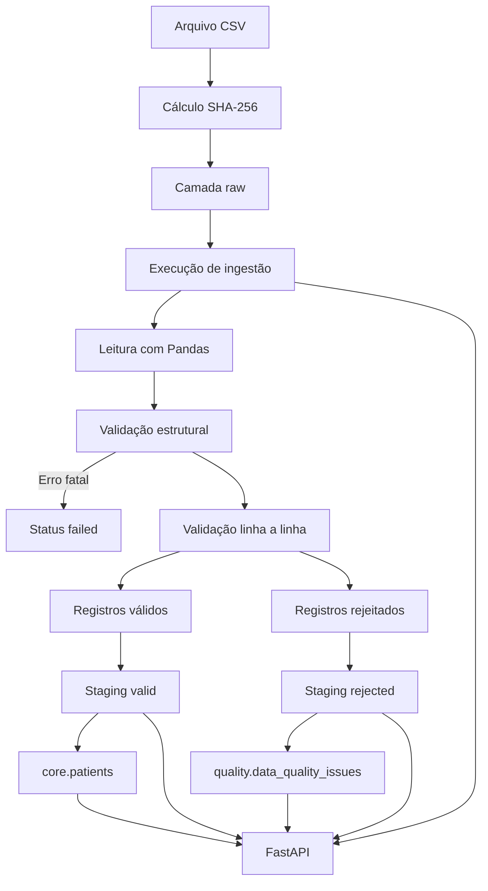

# Arquitetura do DataLake

## 1. Visão geral

O DataLake é uma plataforma educacional de engenharia de dados em saúde.

A aplicação recebe pacientes sintéticos por CSV, preserva a origem, valida a qualidade, mantém uma camada de staging, carrega dados confiáveis no core e disponibiliza consultas por meio de uma API REST.

## 2. Diagrama principal



## 3. Schemas PostgreSQL

### `ingestion`

Mantém:

- fontes;
- arquivos;
- execuções;
- métricas;
- status.

### `staging`

Mantém todas as linhas recebidas, incluindo o conteúdo bruto e os valores normalizados.

### `quality`

Mantém os problemas encontrados nos registros rejeitados.

### `core`

Mantém os dados confiáveis e tratados.

## 4. Camadas do código

O código-fonte está organizado por responsabilidade dentro de `src/datalake`:

- `api`: aplicação FastAPI, rotas, schemas de resposta, dependências e tratamento de erros;
- `config`: leitura e validação das configurações do ambiente;
- `database`: engine, sessões, metadata e verificação da conexão com o PostgreSQL;
- `ingestion`: leitores, validadores, mapeadores, CLI e camada de compatibilidade da ingestão;
- `models`: modelos SQLAlchemy associados aos schemas PostgreSQL;
- `pipeline`: preparação dos arquivos, armazenamento raw, geração de artefatos e orquestração do ETL;
- `quality`: representação dos problemas de qualidade e geração dos relatórios de rejeição.

As migrations ficam em `alembic`, enquanto os documentos técnicos e operacionais ficam em `docs`.

## 5. Rastreabilidade

Cada arquivo recebido é identificado pelo nome da fonte e pelo hash SHA-256 do conteúdo. A cópia original é preservada na camada raw antes do processamento.

Cada tentativa de ingestão gera uma execução com UUID, versão do pipeline, métricas, horários e um dos seguintes status:

- `running`;
- `completed`;
- `completed_with_rejections`;
- `failed`;
- `skipped_duplicate`.

Todas as linhas recebidas são vinculadas à execução no schema `staging`. Os registros rejeitados são associados aos respectivos problemas no schema `quality`, enquanto os registros válidos podem apontar para o paciente correspondente em `core.patients`.

Essa relação permite navegar no sentido:

```text
fonte → arquivo → execução → linha de staging → problema ou paciente
```

Arquivos já concluídos são ignorados por padrão. O argumento `--force` permite criar uma nova execução e um novo staging sem duplicar pacientes existentes.

## 6. Testes

A suíte utiliza um PostgreSQL exclusivo, configurado por `.env.test` e `compose.test.yaml`. O nome do banco deve terminar em `_test`, protegendo o banco de desenvolvimento contra uso acidental.

As migrations são aplicadas automaticamente no início da sessão. Antes e depois de cada teste de integração, as tabelas são limpas para evitar dependência de ordem ou de dados anteriores.

Os testes são divididos pelos marcadores:

- `unit`: regras isoladas e sem dependências externas;
- `integration`: integração com PostgreSQL;
- `api`: contrato HTTP da FastAPI;
- `migration`: upgrade, downgrade e novo upgrade do Alembic.

A cobertura considera linhas e branches. O projeto exige cobertura total mínima de 80% e gera relatórios no terminal, em HTML e em XML.

## 7. CI

O workflow `.github/workflows/ci.yml` executa a validação automatizada em pull requests e pushes para a branch `main`. Ele também aceita execução manual por `workflow_dispatch`.

O pipeline de integração contínua possui três jobs:

### `Quality`

- instala o projeto e as dependências de desenvolvimento;
- verifica a formatação e o lint com Ruff;
- compila os módulos Python;
- constrói o wheel e o source distribution;
- valida a consistência entre a versão do pacote e a versão da API;
- publica o pacote como artifact.

### `Tests and coverage`

- inicia um PostgreSQL exclusivo no runner;
- executa a suíte completa;
- mede a cobertura de linhas e branches;
- publica JUnit XML, Coverage XML e o relatório HTML como artifacts.

### `Docker build`

- aguarda a aprovação dos jobs de qualidade e testes;
- valida o Docker Compose;
- constrói a imagem da API;
- confirma os metadados do pacote dentro da imagem.
